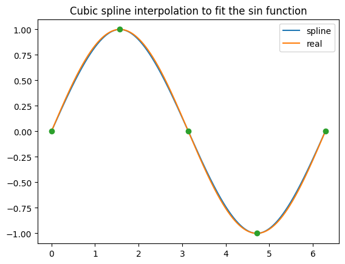
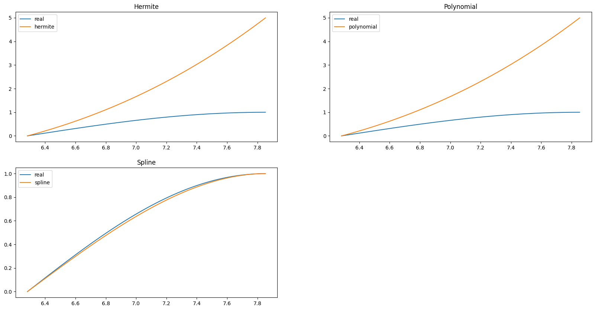
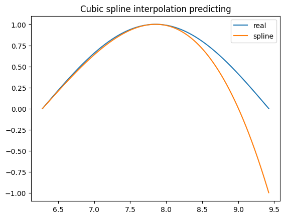
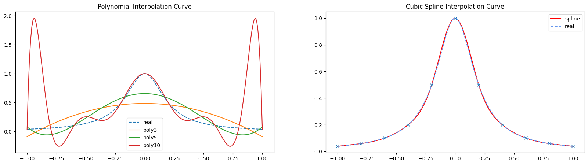

写在之前：本篇文章是我这个学期某门选修课的大作业，花费了我接近三个下午完成，发布该博客以做记录留念。（文章中某一些看起来比较奇怪的格式可能是因为之前要用pandoc生成pdf，其要求的某些格式比较奇怪，markdown无法正确编译，也无需在意）

## 一. 引言

### 1. 算法简介

插值是一种通过已知的、离散的数据点，在范围内推求新数据点的过程或方法[@插值算法的介绍及其在数学建模中的应用]。在真实场景中，往往我们获取的数据会出现遗漏或者较少的情况，插值可以模拟并产生一些新的合理的数据来满足我们的需求；此外，插值还可以解决一些短期预测问题[@插值]。

样条插值是一种将整个数据范围分为多个区间，使用特殊的分段多项式来进行插值的方式；而三次样条插值则是一种在每一个区间内使用三次多项式的样条插值方法[@样条插值]。使用高阶多项式插值时往往会出现龙格现象，即一种拟合的边缘震荡问题，而三次样条插值则可以避免该问题；同时三次样条插值还有高精度及高稳定性、拟合形状灵活等优点[@三次样条插值]。

关于三次样条插值的优缺点还将在下面的第二部分进一步讨论。

### 2. 其他插值算法

#### （1）线性插值

线性插值是一种简单的插值方法，广泛应用于数学、计算机图形学等领域。它用一个线性函数来估计两个已知点之间的未知值。线性插值计算简单，但其产生的插值函数是线性的，其预测的数据往往会产生较大的误差；且线性插值在各个样本点处不光滑，不能捕捉到底层函数的高阶曲率特征。

#### （2）拉格朗日插值法（多项式插值）

拉格朗日插值是线性插值的推广。拉格朗日插值拟合的函数可以通过所有的已知样本点，解决了线性插值的大部分问题：其在各个样本点处光滑可导，也可以估计样本点之外的局部最大值和最小值。但这种插值方法同样有一些缺点，比如会出现龙格现象，以及计算成本昂贵等问题。

#### （3）牛顿插值法

牛顿插值法是一种利用差商来计算插值的方法。与拉格朗日插值法相比，牛顿插值法的计算过程具有继承性（牛顿插值法每次插值只和前n项的值有关，这样每次只要在原来函数上添加新的项，就能够产生新的插值函数），但其也存在龙格现象。

上述三种插值法仅要求插值函数在插值节点处与真实样本点相同，没有保证在这些点处有相同的导数值，所以这些插值法不能表现出样本数据的真实特性，无法满足实际应用要求。

#### （4）埃尔米特插值

这种插值方法不但要求节点上的函数值相等，而且要求对应的导数值也相等，甚至要求高阶导数也相等，满足这种要求的插值多项式就是埃尔米特插值多项式[@常见的插值算法]。在实际应用中往往使用分段三次埃尔米特插值来避免出现龙格现象。

## 二. 原理

### 1. 基本形式

假设我们有一组数据点 $(x_0, y_0), (x_1, y_1), \ldots, (x_n, y_n)$，其中 $x_0 < x_1 < \ldots < x_n$。三次样条插值的目标是找到一组三次多项式 $S_i(x)$（其中 $i = 0, 1, \ldots, n-1$），使得每个多项式在相应的区间 $[x_i, x_{i+1}]$ 内满足三次样条的约束条件（稍后说明）。

在每个区间 $[x_i, x_{i+1}]$ 上，三次样条可以表示为：
$$
S_i(x) = a_i + b_i(x - x_i) + c_i(x - x_i)^2 + d_i(x - x_i)^3
$$
其中 $a_i, b_i, c_i$ 和 $d_i$ 是需要确定的系数。

### 2. 约束条件

#### （1）插值条件

在每个插值节点处，样条函数的值与数据点的值相等：

$$
S_i(x_i) = y_i, \quad S_i(x_{i+1}) = y_{i+1}, \quad \text{for} \quad i = 0, 1, \ldots, n-1
$$

#### （2）连续性条件

1） **样条函数在每个内部节点处连续**，即：

$$
S_i(x_{i+1}) = S_{i+1}(x_{i+1}), \quad \text{for} \quad i = 0, 1, \ldots, n-2
$$

2） **样条函数的一阶导数在每个内部节点处连续**，即：

$$
S_i'(x_{i+1}) = S_{i+1}'(x_{i+1}), \quad \text{for} \quad i = 0, 1, \ldots, n-2
$$

3） **样条函数的二阶导数在每个内部节点处连续**，即：

$$
S_i''(x_{i+1}) = S_{i+1}''(x_{i+1}), \quad \text{for} \quad i = 0, 1, \ldots, n-2
$$

#### （3）边界条件

为了使问题有唯一解，我们需要两个额外的条件（边界条件）：

- 自然边界条件（第二导数在边界处为零）：

$$
S_0''(x_0) = 0, \quad S_{n-1}''(x_n) = 0
$$

### 3. 计算求解

计算过程可以分为以下三步：*构建矩阵方程、利用高斯消去求解法等数值计算方法求解方程组进而得到各系数，将求得的系数带回三次多项式进而构造出每个区间上的三次样条函数*。接下来对上述第一个步骤，即**构建矩阵方程**进行详细讨论。

需要用上述约束条件构建矩阵方程，下面对每一个条件依次讨论。

**插值条件**：
由 $S_i(x_i) = y_i$ 和 $S_i(x_{i+1}) = y_{i+1}$ 得：
$$
\begin{cases}
a_i = y_i \\
a_i + b_i h_i + c_i h_i^2 + d_i h_i^3 = y_{i+1}
\end{cases}
$$其中 $h_i = x_{i+1} - x_i$。

**连续性条件**：
由 $S_i(x_{i+1}) = S_{i+1}(x_{i+1})$ 得：

$$
a_i + b_i h_i + c_i h_i^2 + d_i h_i^3 = a_{i+1}
$$

由 $S_i'(x_{i+1}) = S_{i+1}'(x_{i+1})$ 得：

$$
b_i + 2c_i h_i + 3d_i h_i^2 = b_{i+1}
$$

由 $S_i''(x_{i+1}) = S_{i+1}''(x_{i+1})$ 得：

$$
2c_i + 6d_i h_i = 2c_{i+1}
$$

**边界条件**：
由自然边界条件，得：

$$
2c_0 = 0, \quad 2c_{n-1} + 6d_{n-1} h_{n-1} = 0
$$

通过以上条件，我们可以构建一个线性方程组来求解 $a_i, b_i, c_i, d_i$：

设 $M_i = S_i''(x_i)$，$m_i = \frac{y_{i+1} - y_i}{h_i}$，
则 $a_i = y_i$， $b_i = m_i - \frac{h_i(2M_i + M_{i+1})}{6}$， $c_i = \frac{M_i}{2}$， $d_i = \frac{M_{i+1} - M_i}{6h_i}$

我们可以得到方程：

$$
h_{i-1} M_{i-1} + 2(h_{i-1} + h_i) M_i + h_i M_{i+1} = 6(m_i - m_{i-1})
$$

这个方程组是一个三对角矩阵，可以使用三对角矩阵算法（例如 Thomas 算法）高效求解。求解这个方程组得到 $M_i$ 后，代回每个区间的多项式系数表达式中，从而得到所有的 $a_i, b_i, c_i, d_i$。

带入系数，得到三次样条插值函数 $S(x)$ 是每个区间上的多项式的集合，即：

$$
S(x) = S_i(x) \quad \text{for} \quad x \in [x_i, x_{i+1}]
$$

### 4. 扩充区间

上述计算得到的三次样条插值函数只能进行内插，即拟合给定的已知数据区间范围内的函数，而无法预测范围之外的数值。为解决这一问题，现在需要将三次样条插值算法的拟合区间进行扩充。

假设已知$n$个样本数据点，将这些已知数据点从小到大排列，则当需要预测的样本数据小于所有已知数据时，令 $S(x) = S_1(x)$ ；当需要预测的样本数据小于所有已知数据时，令 $S(x) = S_{n}(x)$。于是，得到最终的三次样条插值函数:
$$
S(x) =
\begin{cases}
S_0(x) \quad \text{for} \quad x \in (-\infty,x_1) \\
S_i(x) \quad \text{for} \quad x \in [x_i, x_{i+1}]\\
S_n(x) \quad \text{for} \quad x \in (x_n,+\infty)
\end{cases}
$$

## 三. 实现与应用

下面我们将三次样条插值算法分别应用于补全数据和预测两个方面，以拟合sin函数为例，分析该算法解决上述两方面问题的能力。（实现该算法的代码请详见附录）
我们在sin函数上 $[0,2\pi]$ 区间内，等距离地取五个样本点：$(0,0), (\frac{1}{2}\pi,1),(\pi,0),(\frac{3}{2}\pi,-1),(2\pi,0)$；以这些样本点作为已知点，带入程序中，使用三次样条插值法求解。

### 1. 数据补全（内插）

{#fig:1}

使用三次样条插值算法对已知数据点范围内进行插值拟合，我们将拟合的函数与原函数放置于同一张图片中对比分析，可以看出拟合函数与真实函数几乎重合，且拟合函数在样本点处非常光滑，说明拟合精度较高。

| algorithm name | MSE      | RMSE     | MAE      | R2_Adjudged |
|----------------|----------|----------|----------|-------------|
| Cubic Spline   | **0.000179** | **0.013415** | **0.011618** | **0.999639** |
| Linear | 0.022760 | 0.150867 | 0.136602 | 0.954436 |
| Polynomial | 0.009748 | 0.098734 | 0.083322 | 0.980484 |
| Hermite | 0.009748 | 0.098734 | 0.083322 | 0.980484 |

我们同时使用线性插值、拉格朗日多项式插值和埃尔米特插值来对该sin函数进行数据补全，并且分别从**MSE（均方误差）**、**RMSE（均方根误差）**、**MAE（平均绝对误差）** 和 **Adjudged_R2（矫正决定系数）** 四个评价指标来分析比较以上三次样条插值法与以上三种算法对于Sin函数的拟合精度。根据上表，不难看出三次样条插值在四种评价指标中都有较好的表现，说明相较其他三种插值算法，三次样条插值在处理数据补全（内插）问题时具有更高的精度。

### 2. 预测（外插）

使用三次样条插值算法进行短期预测（预测范围为$[2\pi~\frac{5}{2}\pi]$），并同样与多项式插值和埃尔米特插值的预测结果进行比较，得到下图。由所得的图像可以很明显看出三次样条插值的预测结果要优于多项式插值与埃尔米特插值的预测结果。

{#fig:2}

使用三次样条插值算法扩大预测范围，得到下图所示的结果。由图像可以看出，在短期预测的范围内（$[2\pi~\frac{5}{2}\pi]$）由三次样条插值预测的函数值与真实函数值重合度较高；而在更大的预测范围中，由三次样条插值法得到的函数曲线迅速随预测样本与已知样本的距离增加而偏离真实函数曲线，这表明在长期预测中，三次样条插值的预测准确度较差。

{#fig:3}

我们将$[2\pi,3\pi]$均分为五个区间，在每个区间内分别评价预测的准确度指标，得到下表：

| interval | MSE      | RMSE     | MAE      | R2_Adjudged |
|----------------|----------|----------|----------|-------------|
| $[2.0Pi,2.2Pi]$ | 0.000178 | 0.013372 | 0.011951 | 0.993839 |
| $(2.2Pi,2.4Pi]$ | 0.000265 | 0.016288 | 0.015775 | 0.976360 |
| $(2.4Pi,2.6Pi]$ | 0.000020 | 0.005128 | 0.003637 | 0.876294 |
| $(2.6Pi,2.8Pi]$ | 0.013206 | 0.114921 | 0.095750 | -0.177817 |
| $(2.6Pi,2.8Pi]$ | 0.357571 | 0.597972 | 0.555832 | -11.32080 |

由表可以得到与观察函数图像相同的结果，即当预测样本处于$[2\pi~\frac{5}{2}\pi]$区间时，预测效果较好，而之后预测样本的准确度迅速下降，无法很好地预测之后的数据。

出现该现象可以由三次样条插值法的局部性来进行解释：三次样条插值法的每段样条只依赖于其相邻数据点，当预测样本超出数据点的范围时，三次样条插值法就丧失了数据点的约束条件，只能用最接近该预测样本的样条函数来进行预测，这就会造成预测的不合理行为。且预测样本与已知样本的距离越远，样条函数与真实函数的偏差越大，预测的准确度也就越低。

## 四. 评价

### 1. 算法优点

- **适应性强**：
三次样条插值可以生成平滑的曲线，并且保证曲线的一阶和二阶导数是连续的。这对于数据补全非常重要，因为它可以避免补全点处的剧烈变化或不连续性。这种特性使得三次样条插值有更好的适应性，也就是说该算法对于线性或是非线性的数据点都能取得较好的拟合效果。[@de1978practical]

- **避免龙格现象**：
三次样条插值是局部的，即每段样条仅受其相邻数据点的影响。这意味着补全一个缺失值只会影响该值附近的点，而不会影响全局，这使得该算法能够较好地避免龙格现象。我们可以通过用三次样条插值拟合 $y=\frac{1}{1-25x^2}$ 函数来检验该优点。下面分别对该函数应用多项式插值和三次样条插值来进行拟合，结果如下图，可以观察到使用多项式插值时，多项式的次数越高，产生的龙格现象越显著，而使用三次样条插值则能避免该问题。

{#fig:4}

- **预测的局部逼真度**：
在已知数据点的范围内，三次样条插值能够生成非常逼真的预测结果，特别是当数据点分布均匀时，插值曲线的拟合度较高。

### 2. 缺陷

- **过拟合风险**：
在数据点较少或不规则的情况下，三次样条插值可能会出现过拟合现象，导致插值曲线在某些区域产生不合理的波动。[@friedman2009elements]

- **外插不稳定性**：
在已知数据点范围外进行预测时，三次样条插值可能会出现不稳定性，生成的预测值可能会偏离实际情况。这是由于多项式在边界外的行为难以预测导致的。

- **对异常值敏感**：
三次样条插值对数据中的异常值较为敏感，这些异常值可能会显著影响插值曲线的形状，从而影响预测结果的准确性。

## 五. 结论

三次样条插值算法在数据补全和短期预测方面表现出色，特别是在需要生成平滑过渡和高精度拟合的应用场景中，具有显著的优势。然而，其外插不稳定性和对异常值的敏感性限制了其在长期预测中的应用。为了在实际使用中充分发挥三次样条插值的优点，需要结合具体应用场景的需求，综合考虑数据的分布特点和异常值的影响，选择合适的插值方法或其他拟合算法。

### 附录A    实现三次样条插值的python代码

```[python]
import numpy as np

#通过已知样本点（x,y）计算三次样条插值的参数
def cubic_spline_interpolation(x, y):
    n = len(x) - 1

    # 计算公式定义的h，m（已知数据）
    h = np.diff(x)
    m = np.diff(y) / h

    # 初始化矩阵和向量
    A = np.zeros((n+1, n+1))
    b = np.zeros(n+1)

    # 三次样条插值法的自然边界条件
    A[0, 0] = 1
    A[n, n] = 1

    # 用实际的数据填充矩阵和目标向量
    for i in range(1, n):
        A[i, i-1] = h[i-1]
        A[i, i] = 2 * (h[i-1] + h[i])
        A[i, i+1] = h[i]
        b[i] = 6 * (m[i] - m[i-1])

    # 利用numpy库对方程组进行线性求解，得到的值赋给变量M
    M = np.linalg.solve(A, b)

    # 由得到的M，回带到原方程中，得到参数a、b、c、d
    a = y[:-1]
    b = np.zeros(n)
    c = M / 2
    d = np.zeros(n)
    for i in range(n):
        b[i] = m[i] - h[i] * (2 * M[i] + M[i+1]) / 6
        d[i] = (M[i+1] - M[i]) / (6 * h[i])

    # 结构化参数
    splines = []
    for i in range(n):
        spline = {
            'a': a[i],
            'b': b[i],
            'c': c[i],
            'd': d[i],
            'x0': x[i],
            'h': h[i]
        }
        splines.append(spline)

    return splines

#根据参数，获取带预测样本，代入公式求得预测值
def evaluate_spline(splines, x_val):
    y = []
    for x in x_val:
        #判断是内插还是外插，外插需要根据扩展公式来进行插值
        if x < splines[0]['x0']:
            dx = x - splines[0]['x0']
            y.append(splines[0]['a'] + splines[0]['b'] * dx + splines[0]['c'] * dx**2 + splines[0]['d'] * dx**3)
        elif x > splines[-1]['x0']:
            dx = x - splines[-1]['x0']
            y.append(splines[-1]['a'] + splines[-1]['b'] * dx + splines[-1]['c'] * dx**2 + splines[-1]['d'] * dx**3)
        else:
            for spline in splines:
                if spline['x0'] <= x <= spline['x0'] + spline['h']:
                    dx = x - spline['x0']
                    y.append(spline['a'] + spline['b'] * dx + spline['c'] * dx**2 + spline['d'] * dx**3)
    return y
```
